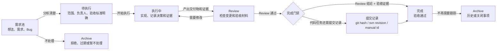
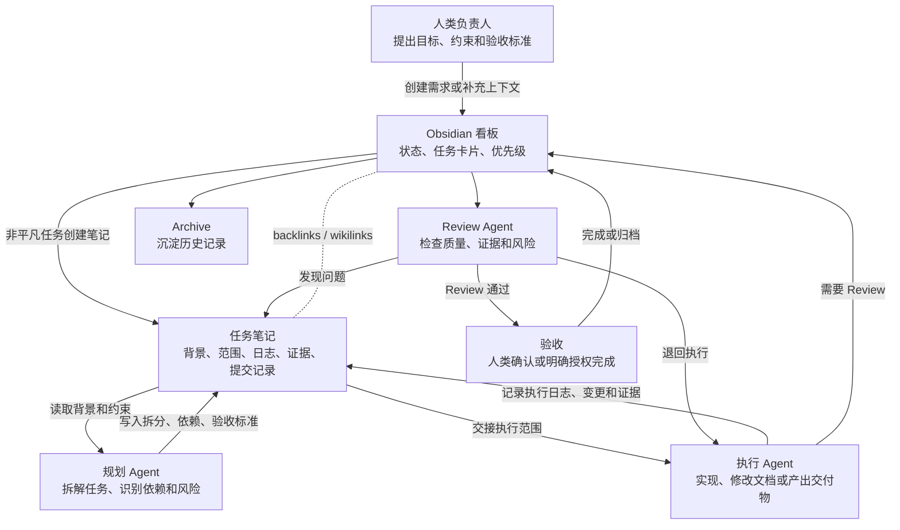

# obsidian-project-workflow

面向 Obsidian 项目管理的通用 agent skill。它让 AI 代理把任务状态、需求分析、执行记录、Review 结果、提交信息和验收证据写回同一个 Obsidian vault，而不是散落在聊天记录、终端输出和临时文件里。

## 适用场景

- 你已经用 Obsidian 管项目、需求、研发笔记或个人任务。
- 你希望代理能读取项目看板，回答当前进展、阻塞点和待 Review 事项。
- 你希望从需求池到执行、Review、完成、归档都有清晰状态。
- 你希望每个非平凡任务都有独立任务笔记，记录背景、范围、验收标准、执行日志、提交记录和证据。
- 你需要在人和多个代理之间交接任务，并保留可追溯上下文。

## 能力概览

- 读取 Obsidian Kanban 看板并输出简洁项目状态。
- 初始化项目目录、任务看板和任务笔记。
- 创建任务卡片，并链接到 vault 内的任务笔记。
- 在 `需求池 -> 待执行 -> 执行中 -> Review -> 完成 -> Archive` 之间移动任务。
- 自动维护任务笔记中的状态、执行记录和 Review 信息。
- 按需记录并校验 git、svn 或用户手动提交的版本信息。
- 优先通过 `obsidian` CLI 操作当前 vault，避免误把代码仓库或 skill 安装目录当成知识库。

## 安装

```bash
npx skills add https://github.com/giarld/skills --skill obsidian-project-workflow
```

## 快速开始

查询当前项目看板：

```bash
obsidian search query="任务看板" limit=20
obsidian read path="项目名称/任务/任务看板.md"
```

初始化项目任务区：

```bash
python3 scripts/init_project.py --project-name "项目名称" --board-name "任务看板.md"
```

创建任务并放入需求池：

```bash
python3 scripts/create_task.py --project-name "项目名称" --title "登录流程优化" --column "需求池" --board-name "任务看板.md"
```

把任务移动到 Review：

```bash
python3 scripts/move_task.py --project-name "项目名称" --title "登录流程优化" --to-column "Review" --board-name "任务看板.md"
```

记录一次代码提交：

```bash
python3 scripts/record_commit.py --project-name "项目名称" --title "登录流程优化" --vcs git --repo-path "/path/to/repo"
```

Windows 环境中建议使用 `python`，处理中文项目名或任务名时设置 `PYTHONUTF8=1`。

## 前提条件

1. 已安装并启动 Obsidian。
2. 已在 Obsidian 设置中启用命令行界面，可通过 `obsidian help` 验证。
3. 已安装并启用 Obsidian Kanban 插件。
4. 当前 Obsidian 窗口聚焦在目标 vault。多 vault 同时打开时，请显式指定 vault 或先切换到目标 vault。

本 skill 维护的看板使用 Kanban 插件格式：

```yaml
---
kanban-plugin: board
---
```

## 工作流模型

默认看板列为：

```text
需求池 -> 待执行 -> 执行中 -> Review -> 完成 -> Archive
```

整体流程：



多 Agent 协作流程：



每个任务笔记建议包含：

- 背景和目标
- 范围和排除项
- 验收标准
- 依赖和风险
- 执行日志
- 提交记录
- Review 结论
- 测试、截图、日志或其它验收证据

移动到 `完成` 前，应能在任务笔记中看到明确 Review 结论和验收证据。代码任务需要额外设置 `requires_commit: true` 或在移动时使用 `--require-commit`，并记录对应的 git hash、svn revision 或用户提供的提交信息。

## Vault 结构

初始化后会在 Obsidian vault 中创建：

```text
项目名称/
├── 文档/
└── 任务/
    ├── *任务看板.md
    └── Tasks/
```

`任务看板.md` 是默认看板名，也可以使用任意匹配 `*任务看板.md` 的单文件看板名。

## 随附资源

- `SKILL.md`: agent 使用本 skill 时遵循的主指令。
- `assets/kanban-template.md`: Kanban 看板模板。
- `assets/task-note-template.md`: 任务笔记模板。
- `scripts/init_project.py`: 初始化项目目录和看板。
- `scripts/create_task.py`: 创建任务笔记和看板卡片。
- `scripts/move_task.py`: 移动任务卡片并同步任务状态。
- `scripts/record_commit.py`: 写入 git、svn 或手动提交记录。
- `scripts/resolve_vault.py`: 解析当前 Obsidian vault 路径。
- `references/obsidian-cli-quickref.md`: Obsidian CLI 速查。
- `references/workflow-model.md`: 工作流门禁、交接和 Review 规则。

## 路径原则

- Obsidian vault 是项目事实来源。
- 优先通过 `obsidian` CLI 读写当前已启动的 vault。
- 不把会话目录、源码目录或 skill 安装目录当作 Obsidian vault。
- 只有脚本初始化或 CLI 无法完成操作时，才解析 vault 文件系统路径。
